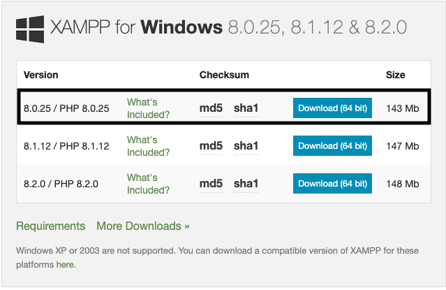
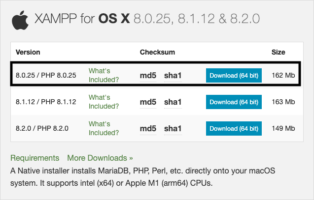
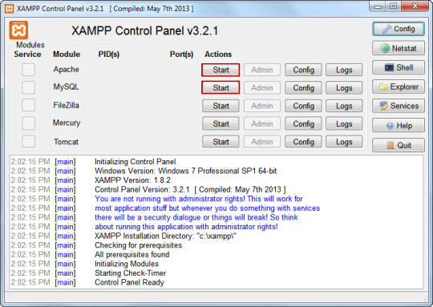
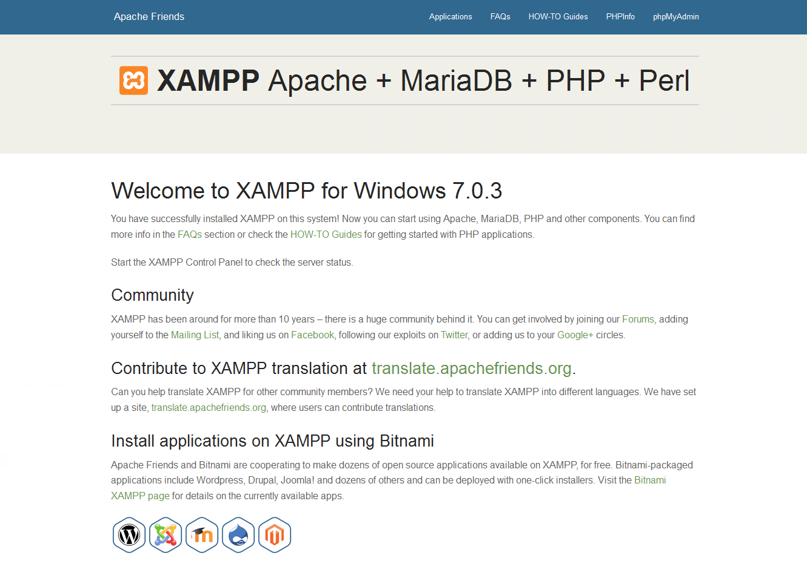
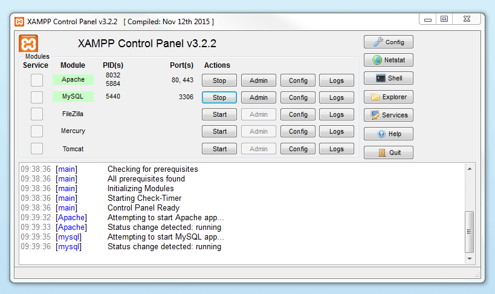
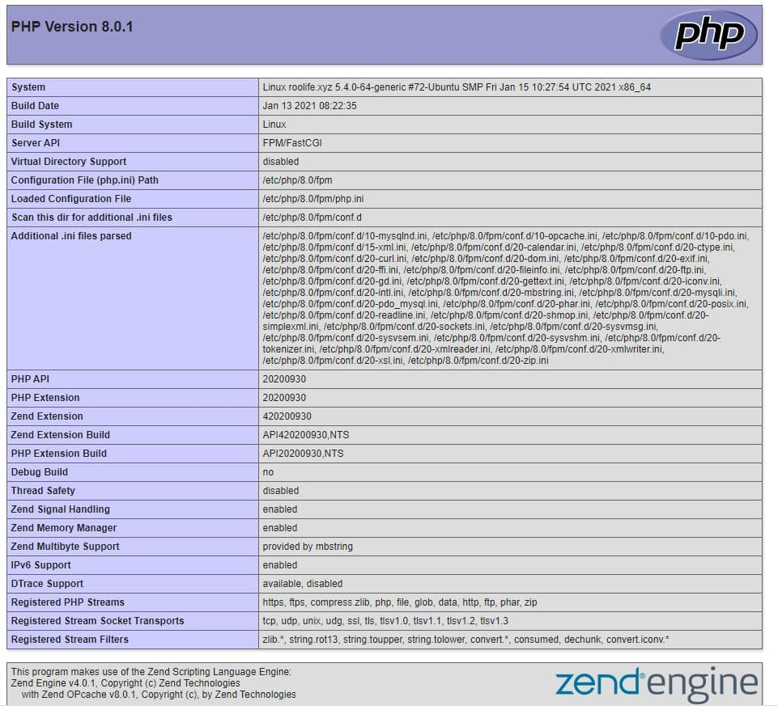

# ITAS 186 – Lab #1 PHP Development Environment Setup

Author: Bill Dou \
Email: bill.dou@itas.ca \
Updated on Jan 8, 2023

## Install XAMPP on Windows / MacOS

1. Install Chrome
2. Install XAMPP Server

   - Go to https://www.apachefriends.org/download.html
   - Click on related `8.0.25 / PHP 8.0.25 ... Download(64 bit)` link to download the XAMPP installer file for your OS.

   Windows:

   

   MacOS:

   

   - Double-click the downloaded file. This file should be named something like `xampp-windows-x64-8.0.25-0-VS16-installer.exe`, and you'll find it in the default downloads location (e.g., the "Downloads" folder or the desktop).
   - Click **Yes** when UAC is prompted. This will open the XAMPP setup window.
   - Click all Next button till you see **Finish** button.
   - Start XAMPP from its installation point

3. Start the XAMPP control panel

   
   Click the **Start** button right side of Apache module to run Apache service.

4. In your browser, go to http://localhost, you should see the a web page similar to the following:

   
   If you can't get that page, there must be something wrong with your XAMPP configuration.

## Create a new Apache Virtual Host

1. Delete all files and folders in directory of `C:\xampp\htdocs`
2. Make a new directory `C:\xampp\htdocs\itas186php.local`
3. In the directory, create a new text file called `index.php` and add the following line:
   ```php
   <?php  phpinfo();  ?>
   ```
   Save the file.
4. Edit the file: `C:\xampp\apache\conf\extra\httpd-vhosts.conf` and append the following lines at the end of file:

   ```
   <VirtualHost *:80>
       ServerAdmin youremail@itas.ca
       DocumentRoot "C:/xampp/htdocs/itas186php.local"
       ServerName itas186php.local
       ErrorLog "logs/itas186php-error.log"
       CustomLog "logs/itas186php-access.log" common
   </VirtualHost>
   ```

5. Edit your 'hosts' file
   - `C:\Windows\System32\drivers\etc\hosts` (Windows)
   - `/etc/hosts` (MacOS) \
      and append the line:
     `   127.0.0.1   itas186php.local`
6. Restart Apache. Check to make sure the Apache module background color goes green, which indicates it successfully started.

   

7. In your browser, go to http://itas186php.local. You should see the a report of your php configuration:

   

## Open `itas186php.local` codebase in VSCode

1. Install Visual Studio Code
2. Open `itas186php.local` folder by VS Code.
