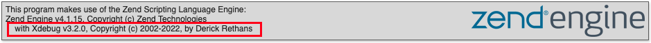
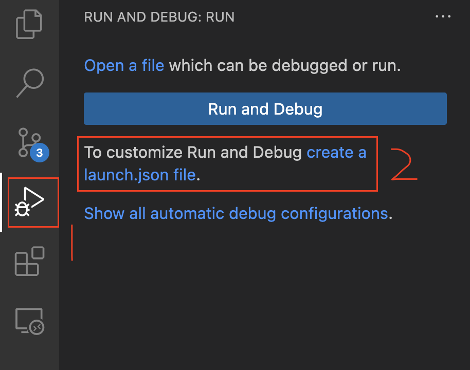
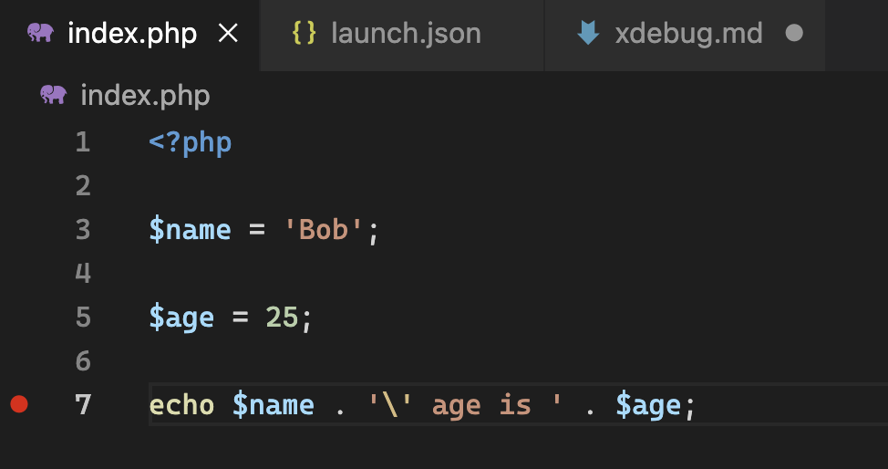
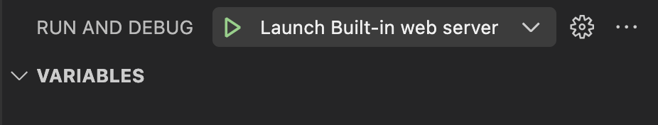
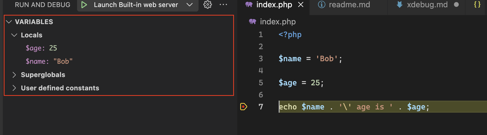
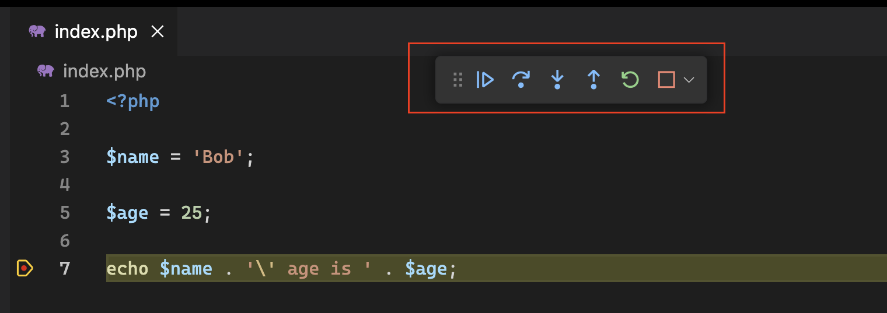

# Lab - Use Xdebug with VS Code

## Install Xdebug in XAMPP

Make sure you have seen the Xdebug section on PHP info page (You can search "xdebug" on the page to verify it).


## Setup Xdebug in VS Code

1. Install the ["PHP Debug"](https://marketplace.visualstudio.com/items?itemName=xdebug.php-debug) plug-in for VSCode made by Xdebug.
2. In your project, go to the debugger (arrow with the bug icon) and hit the 'create a launch.json file' link. Choose PHP and a new launch configuration will be created for you.

3. If this is your first time you need to add the path(C:\xampp\php\php.exe) of your php.exe file into "PHP Debug" extension settings.

```json
"php.debug.executablePath": "C:\xampp\php\php.exe"
```
4. It's time to use it.

    1. Create a test.php file in the project root directory and add the following code:
        ```php
        <?php

        $name = 'Bob';

        $age = 25;

        echo $name . '\' age is ' . $age;
        ```
    2. Add a breakpoint on line "echo $name ..." like below:
    
    3. Click the debug button on left sidebar and choose "Launch Built-in web server" and then click start icon
    
    4. A new browser tab should be opened automacally and it will be kept as loading status. In VSCode left sidebar, you should see the variables you just defined.
    
    5. Try the functionalities in xdebug floating bar:
    
    